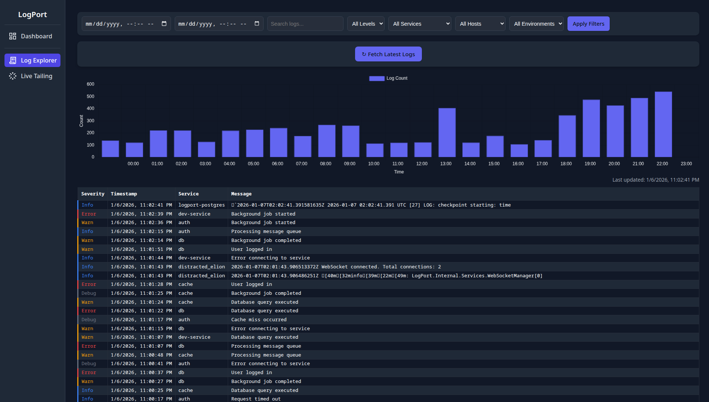
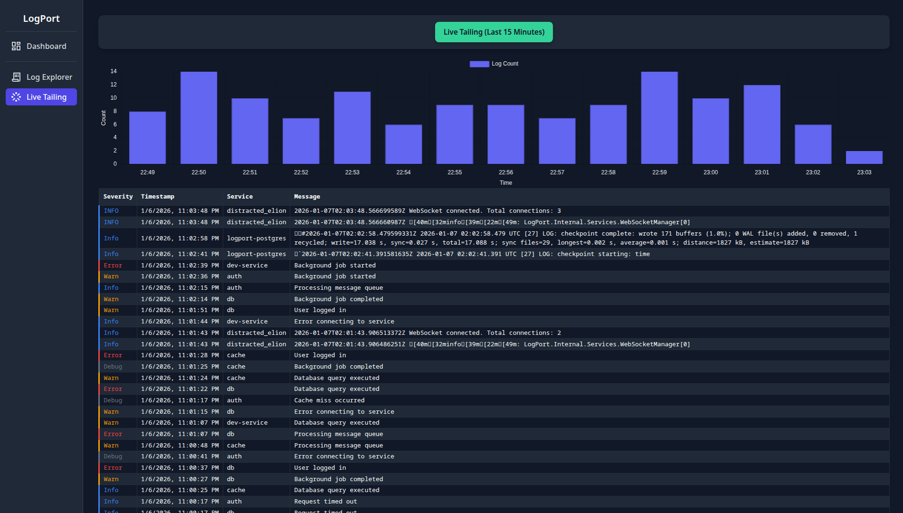

<h1 align="center">Logport</h1>

<p align="center">
  <a href="https://github.com/thiagomvas/LogPort/actions/workflows/nightly-deploy.yml">
    
  </a>
  <a href="https://github.com/thiagomvas/logport/labels/good%20first%20issue">
    
  </a>
  <a href="https://github.com/thiagomvas/logport/labels/help%20wanted">
    
  </a>
  
  
  
</p>

<p align="center">
  A self-hosted log aggregation and analytics platform designed to be the central <strong>port</strong> for all your application logs.
</p>

> [!WARNING]  
> This project is still under heavy development and is not ready to be used in production environments.

---
## Overview

Just like a real port connects ships from around the world, Logport connects logs from every corner of your system 
from lightweight services to enterprise-scale applications and brings them together in one place for analysis and insight.

## Features

- Centralized log aggregation  
- Multi-service and multi-source log ingestion  
- Structured log processing and customizable extraction rules using Regex and JSON paths
- Built-in dashboard  
- Multiple ingestion options:
  - SDK (direct communication)
  - Docker logs
  - File tailing
- Self-hosted and fully open-source



*Log Explorer view. Logs are randomly generated.*


*Live Tail page getting logs in real time. Logs are randomly generated.*


## Development

Logport is designed to ship as a **single container**, bundling both the backend agent and the UI. During development, this introduces a few important details to be aware of, especially when working on the frontend.

### Project Structure (High-level)

- **`LogPort.Agent`** – Backend service (API, ingestion, processing)
- **`LogPort.UI`** – Frontend application (built as static assets)
- **Single-container build** – The UI is compiled into static files and embedded into the agent at build time

### How the Build Works

1. The `LogPort.UI` project is built into static files.
2. These files are copied into the agent’s `wwwroot`.
3. The backend is then built and served with the embedded UI.

When running the agent without a prior UI build, warnings about missing static files may appear.  
This is expected behavior during development.

### Prerequisites

- **.NET 9 SDK** 
- **Node.js** 
- **npm** 
- **Docker** (optional, recommended for production-like testing)

### Running the Backend (Agent)

From the repository root or agent project directory:
```bash
dotnet run --project src/LogPort.Agent
```
By default, the agent starts on http://localhost:8080

### Running the UI in Development Mode

For active frontend development, run the UI separately using the dev server.
From the LogPort.UI directory:

```bash
cd src/LogPort.UI
npm install
export LOGPORT_AGENT_URL=localhost:8080
npm run dev
```
